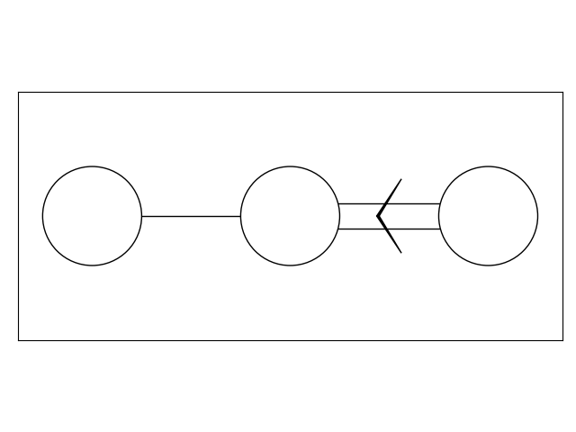

# SemiSimpleRootSystem

Work in progress...

The `main.py` shows and example of how this its used.

## RootSystem

As of now it can generate the entire positive roots and all the roots of the root system. It also can plot the roots in A 2D plane but is only avaliable for root systems having only 2 simple roots. The `main.py` shows the $SU(3)$ root system.

.png "Roots of SU(3)")

## DynkinDraw

It attempts to draw the dynkin diagrams of the given `RootSystem` object with `matplotlib` under the hood. The 2 generated dynkin diagrams from `main.py` are shown below:




## Important Note

Having python version greater than 3.7 is a must since this version assmues that the python dictionaries would maintain the same order after all insertion is done. This was a implemetation effect in the previous versions but it is a must here! The other details of package versions used for the modules are shown below from `conda list` command:

```# Name                    Version                   Build  Channel
_libgcc_mutex             0.1                        main  
_openmp_mutex             5.1                       1_gnu  
bzip2                     1.0.8                h7b6447c_0  
ca-certificates           2022.4.26            h06a4308_0  
certifi                   2022.6.15       py310h06a4308_0  
ld_impl_linux-64          2.38                 h1181459_1  
libffi                    3.3                  he6710b0_2  
libgcc-ng                 11.2.0               h1234567_1  
libgomp                   11.2.0               h1234567_1  
libstdcxx-ng              11.2.0               h1234567_1  
libuuid                   1.0.3                h7f8727e_2  
mpmath                    1.2.1                    pypi_0    pypi
ncurses                   6.3                  h5eee18b_3  
numpy                     1.23.0                   pypi_0    pypi
openssl                   1.1.1p               h5eee18b_0  
packaging                 21.3                     pypi_0    pypi
pillow                    9.2.0                    pypi_0    pypi
pip                       21.2.4          py310h06a4308_0  
pyparsing                 3.0.9                    pypi_0    pypi
python                    3.10.4               h12debd9_0  
readline                  8.1.2                h7f8727e_1  
setuptools                61.2.0          py310h06a4308_0  
six                       1.16.0                   pypi_0    pypi
sqlite                    3.38.5               hc218d9a_0  
sympy                     1.10.1                   pypi_0    pypi
tk                        8.6.12               h1ccaba5_0  
tzdata                    2022a                hda174b7_0  
wheel                     0.37.1             pyhd3eb1b0_0  
xz                        5.2.5                h7f8727e_1  
zlib                      1.2.12               h7f8727e_2  
```